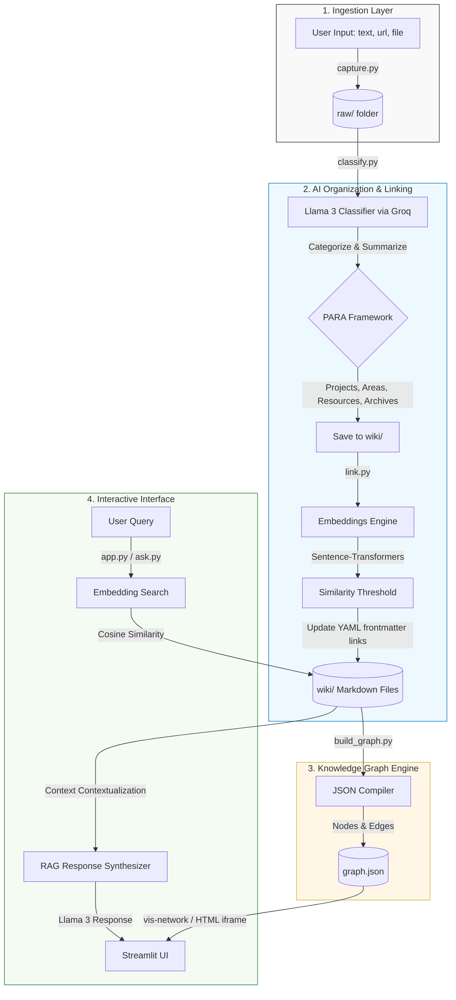

# Project Architecture: SecondSelf 🧠

SecondSelf is an end-to-end personal knowledge management system that ingests scattered information (notes, URLs, and uploaded files), automatically categorizes and semantic-links them, builds an interactive visualization graph of your knowledge base, and lets you ask natural language queries synthesized using RAG (Retrieval-Augmented Generation).

---

## 1. System Topology & Architecture Diagram

The overall system is designed to be local-first, modular, and responsive. It coordinates data ingestion, classification via LLMs, semantic correlation via local sentence embeddings, graph compilation, and Q&A retrieval.



---

## 2. Technical Stack

- **Backend Logic**: Python 3.10+
- **Frontend / Dashboard**: Streamlit (for unified control, side-captures, and tab browsing)
- **Local Embeddings**: `sentence-transformers/all-MiniLM-L6-v2` (384-dimensional, highly performant, runs locally on CPU/GPU)
- **LLM Engine**: Groq API (`llama-3.1-8b-instant` and `llama-3.3-70b-versatile` for fast JSON response mode)
- **Vector Operations**: NumPy & Scikit-learn (cosine similarity)
- **Scraper**: BeautifulSoup4 & Requests (web bookmark extraction)
- **Visualization Library**: `vis-network.js` (rendered in custom Streamlit HTML frame supporting zoom, drag, and custom PARA-categorized styles)

---

## 3. Data Schemas

### 3.1 Raw Capture JSON Schema (`raw/<id>.json`)
```json
{
  "id": "note_1785013412694",
  "type": "note",
  "timestamp": "2026-07-26T02:30:00Z",
  "content": "Raw capture string or scraped webpage body text...",
  "metadata": {
    "url": "https://example.com",
    "title": "Example title"
  }
}
```

### 3.2 Wiki Document Schema (`wiki/<Category>/<id>.md`)
Notes are stored under four subdirectories of `wiki/` corresponding to the PARA method: `Projects/`, `Areas/`, `Resources/`, and `Archives/`.
```markdown
---
id: "note_1785013412694"
title: "Project Alpha Technical Spec"
captured_at: "2026-07-26T02:30:00Z"
category: "Projects"
tags: ["alpha", "spec", "code"]
summary: "Technical requirements and architecture spec for Project Alpha."
links: ["link_1785013418405"]
---

# Project Alpha Technical Spec

Here is the body content of the note...
```

### 3.3 Knowledge Graph Schema (`graph.json`)
```json
{
  "nodes": [
    {
      "id": "note_1785013412694",
      "label": "Project Alpha Technical Spec",
      "category": "Projects",
      "summary": "Technical requirements and architecture spec...",
      "tags": ["alpha", "spec"]
    }
  ],
  "edges": [
    {
      "from": "note_1785013412694",
      "to": "link_1785013418405"
    }
  ]
}
```

---

## 4. Pipeline Execution Flows

### 4.1 Ingestion Flow
1. User provides input (text, link, or path to file) to the Streamlit app sidebar or `capture.py`.
2. The capture script builds an ID using current unix milliseconds (`type_timestamp`).
3. For links: Scrapes titles and filters script/style blocks from body HTML.
4. For files: Copies file to `raw/` and reads content if text-based.
5. Saves raw JSON metadata payload to `raw/`.

### 4.2 Organizing Flow (Classification & Linking)
1. `classify.py` checks for unorganized notes in `raw/` (i.e. those without matching files in `wiki/`).
2. Sends contents to Groq LLM under strict JSON system formatting instructions.
3. Receives PARA category, tags, generated title, and summary.
4. Writes the Markdown note in `wiki/<Category>/<id>.md` using YAML frontmatter templates.
5. `link.py` reads all wiki Markdown files and uses local `SentenceTransformer` to calculate note similarity embeddings.
6. Auto-links matching pairs by appending adjacent node IDs in YAML `links` arrays bidirectionally.

### 4.3 Graph Update Flow
1. `build_graph.py` traverses `wiki/` directory.
2. Extracts nodes from note frontmatters and compiles edges from valid note-to-note references.
3. Writes list objects to `graph.json` loaded dynamically by the Streamlit application.

### 4.4 Q&A Flow (RAG)
1. User submits a query in the Streamlit "Ask Your Brain" panel.
2. `ask.py` computes query embedding using the same `SentenceTransformer` model.
3. Compares cosine similarity against wiki notes embeddings and fetches the top $K$ matching context blocks.
4. Synthesizes a response from the Groq API under instructions to answer **only** based on the matched notes, including source title citations.
